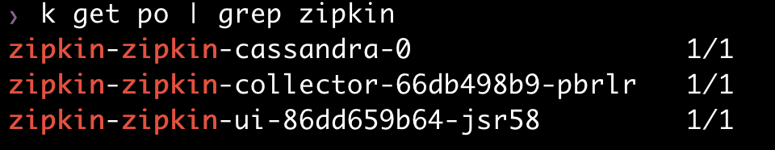

# zipkin-helm
   
zipkin 설치를 위한 helm chart 입니다.  
   
[Financial Time](https://github.com/Financial-Times/zipkin-helm)의 chart를 수정하였습니다.   
DB는 cassandra를 사용하며, PV는 수동으로 만들거나 dynamic provisioning 설정을 하셔야 합니다.   
참조: [Dynamic provisioning](https://kubepia.github.io/cloudpak/cp4app/install/ocp04.html) 


## 설치 
```
$ git clone https://github.com/happyspringcloud/zipkin-helm.git   
$ cd zipkin-helm   
$ vi values.yaml   
내용을 적절히 수정하세요.   
특히, ingress의 host는 변경하셔야 합니다.   
$ helm install <release name> . -n <namespace>    
ex) helm install zipkin . -n zipkin 
```


## 제거   
```
$ helm delete <release name> -n <namespace>
ex) helm delete zipkin -n zipkin  
```
