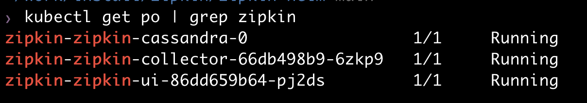
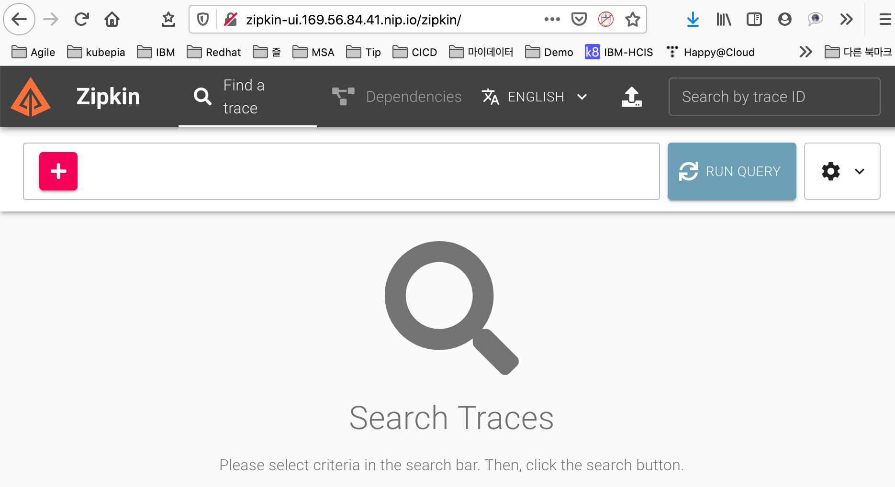

# zipkin-helm
   
> zipkin 설치를 위한 helm chart 입니다.  
   
[Financial Time](https://github.com/Financial-Times/zipkin-helm)의 chart를 수정하였습니다.   
DB는 cassandra를 사용하며, PV는 수동으로 만들거나 dynamic provisioning 설정을 하셔야 합니다.   
참조: [Dynamic provisioning](https://kubepia.github.io/cloudpak/cp4app/install/ocp04.html) 

## 설치 
```
$ git clone https://github.com/happyspringcloud/zipkin-helm.git   
$ cd zipkin-helm   
$ vi values.yaml   
```
values.yaml 파일의 내용을 적절히 수정하세요.  
sample config 파일은 [config.yaml](https://github.com/happyspringcloud/zipkin-helm/blob/main/config.yaml)을 참조하세요.    
특히, collector와 ui ingress의 host는 변경하셔야 합니다.   
또한, NFS Dynamic provisioning을 한 경우 storageClass.provisioner를 아래 명령으로 확인하고 PROVISIONER_NAME의 값과 동일하게 지정하십시오.    
$ kubectl get deploy nfs-client-provisioner -o yaml -n <namespace>

```
$ helm install <release name> . -n <namespace>    
ex) helm install zipkin . -n zipkin 

만약, config.yaml의 설정을 이용하려면 아래와 같이 하십시오.   
$ helm install zipkin -f config.yaml . -n zipkin 
```

모든 pod가 정상적으로 실행될때까지 기다립니다.    
```
$ kubectl get po | grep zipkin
```


모든 pod가 실행된 후에, zipkin-ui ingress host로 확인합니다.


## 제거   
```
$ helm delete <release name> -n <namespace>
ex) helm delete zipkin -n zipkin  
```
